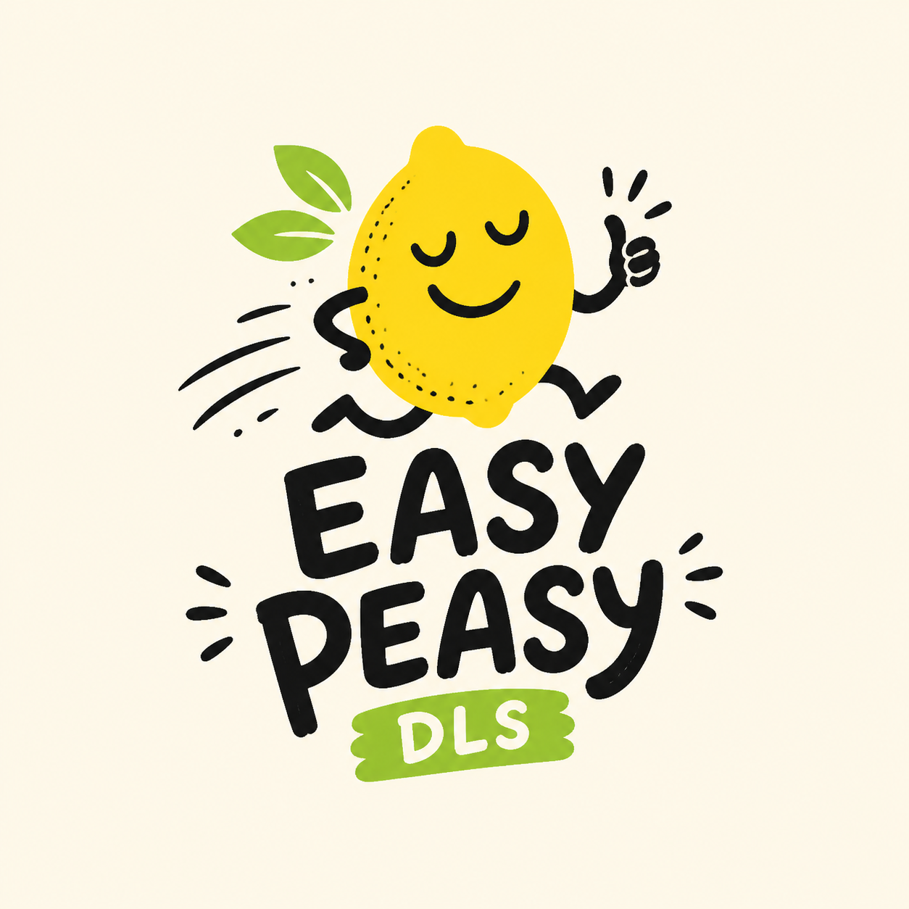

<p align="center">
  
</p>

# Easy Peasy DLS

Simple AI delivery. Proof included.

> [!WARNING]
> **Public preview.** Easy Peasy DLS is alpha software. Contracts may change and
> failures are possible. Keep Git backups and inspect human decision prompts.

**AI-разработка становилась умнее. Мой процесс становился тяжелее.**

Длинные промты, повтор одного контекста, десятки промежуточных документов и
сложный recovery начали отнимать больше внимания, чем продукт. Easy Peasy DLS
оставляет важные решения человеку, а проверяемую механику выполняет локально.

## Как это выглядит

1. **Сформулировали.** Для небольшой задачи достаточно `CHANGE.md`; для
   существенной — SPEC и при необходимости tickets/ADR. Definition,
   architecture и design подтверждаются отдельно.
2. **Сделали.** Codex пишет код. `candidate-ready` запускает только заранее
   зарегистрированные проверки и связывает PASS с точным Git HEAD.
3. **Независимо проверили.** Отдельный read-only review анализирует exact HEAD и
   возвращает canonical ReviewIR.
4. **Приняли.** Человек отдельно принимает реализацию. Release и production
   остаются отдельными границами. DLS показывает точный HEAD и definition,
   человек отвечает только `Да` или `Нет` — копировать идентификаторы не нужно.

Обычный пользователь не вводит CLI, SHA, пути к evidence или ReviewPack.

## Что изменилось в v0.13

- основной проект остаётся единственной точкой входа в Codex;
- DLS до первой правки находит или готовит owner-worktree и направляет туда
  все чтение, изменения, тесты и commit;
- dirty основной checkout остаётся нетронутым, если change принадлежит другому
  чистому owner;
- critical review сразу возвращает `not-clear` после первого blocker или
  should-fix и не тратит второй model call;
- валидный actionable result больше не теряется из-за budget failure
  необязательной lane.
- промежуточный remediation-коммит остаётся checkpoint: DLS готовит ReviewPack
  один раз, только после полной обработки текущих findings.
- `continue-implementation` больше не является поводом завершать задачу или
  просить пользователя написать «продолжай».
- plugin-bundled `Stop` guard технически продолжает преждевременно завершённую
  implementation/remediation-задачу (не больше двух раз за пользовательский
  turn), а не полагается только на текст skill.
- Прерванный незакоммиченный draft можно продолжить после одного вопроса
  «Продолжить существующий черновик? Да / Нет» — без reset, stash или переноса.

## Что изменилось в v0.11 Core Reset

- 12 публичных команд вместо 30;
- один current state вместо operation/recovery ledger;
- routine/standard — один structured Terra review;
- critical — Terra и максимум один Sol reviewer по доказанному риску;
- один compact repair для некорректного JSON, без повторного анализа source;
- одна dependency: `implementation requires OTHER_CHANGE accepted-in-base`;
- Git остаётся источником истины о worktree;
- legacy v1/v2 artifacts архивируются и больше не исполняются.

Подробности и migration: [Core Reset](docs/v0.11.0-core-reset.md).

## Установка

```sh
codex plugin marketplace add alexivengo/easy-peasy-dls
codex plugin add dls@easy-peasy-dls
```

После первой установки или изменения hook откройте `/hooks`, проверьте и один
раз доверьте точное определение Easy Peasy DLS, затем перезапустите Codex.
Codex привязывает доверие к hash hook, поэтому после его изменения запрос может
появиться снова.

В Codex выберите **Easy Peasy DLS: процесс** или просто продолжайте работу в
репозитории с `.dls`:

```text
Реализуй EPIC-02a.
Проведи code review EPIC-02a.
Исправь findings последнего review EPIC-02a.
```

Добавлять epic-worktree как отдельный проект Codex не требуется.

## Proof included

DLS различает:

- implemented;
- validated на exact HEAD;
- review-clear;
- accepted человеком;
- release;
- production.

Один статус не подменяет другой. Receipt доступен через
`status CHANGE_ID --details receipt` и вычисляется без LLM.

## Не ещё один большой framework

BMAD, GSD и Superpowers полезны, когда нужна готовая методология или виртуальная
команда. Easy Peasy DLS — компактный Codex-native delivery layer для
разработчика, который уже принимает продуктовые решения сам и хочет
автоматизировать proof, а не бюрократию.

- [Как это работает](docs/how-it-works.md)
- [Технический контракт](docs/technical-reference.md)
- [Сравнение](docs/comparison.md)
- [Roadmap](docs/roadmap.md)
- [Текущие возможности](docs/capability-catalog.md)

MIT © Alexey Burlakov
