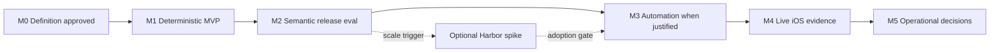

# Easy Peasy DLS Evaluation Framework — roadmap и implementation backlog

Статус: **Draft / definition не утверждена**  
Planning basis: `d7e5d8eb089d5ce860b7f0ac59200d097d9d5003`  
Дата: `2026-08-02`  
Владелец решений: пользователь  
Implementation readiness: **Blocked by definition approval and clean owner workspace**

Этот документ описывает реализацию системы оценки Easy Peasy DLS. Он не
подтверждает архитектуру, не разрешает implementation, не доказывает PASS и не
меняет статусы `review-clear`, `accepted`, `release` или `production`.

Текущий checkout содержит отдельный незавершённый draft линии `v0.13.6`. Eval-
implementation нельзя смешивать с ним. После утверждения definition работа
должна начаться из чистого change/owner-worktree либо после отдельного завершения
текущего draft.

## 1. Решение в одном абзаце

Первая версия не строит новую eval-платформу. Она переиспользует существующие
`unittest` fixtures, fake Codex, DLS telemetry и release-процесс; добавляет пять
hard claims, четыре release-only semantic cases и один decision log. Новый
runner, JSONL ledger, live iOS corpus и внешний Harbor backend появляются только
после измеримого триггера. Harbor включён как optional adoption spike, а не как
зависимость MVP.

## 2. Цели

Evaluation framework должен давать практические ответы на четыре вопроса:

1. Стал ли конечный результат безопаснее и корректнее?
2. Какой компонент действительно изменил результат?
3. Сколько model calls, tokens, времени и человеческого внимания это стоило?
4. Компонент следует оставить, улучшить, упростить, заменить или удалить?

### 2.1. Product outcomes

- Любой safety claim проверяется executable oracle, а не prose verdict.
- Skill, prompt, hook, rule, model route и tool можно сравнить с честным
  component-off baseline.
- Deterministic suite остаётся дешёвой и не делает model calls.
- Semantic review проверяется на frozen clean/seeded cases перед release.
- Real iOS pilots отделяют DLS failure от Xcode, Simulator, signing, network и
  model infrastructure failure.
- По итогам eval остаётся инженерное решение, а не коллекция vanity metrics.

### 2.2. Non-goals

- Не создавать dashboard, database, web service или новую telemetry platform.
- Не писать eval history, raw prompts, transcripts или trajectories в canonical
  DLS state.
- Не вводить composite quality score.
- Не использовать LLM-as-a-judge для hard safety или hidden product behavior.
- Не запускать live models на каждый commit или PR.
- Не оценивать все компоненты матрицей `N × M × 3` без конкретного решения.
- Не добавлять generic MCP evaluator: bundled MCP в DLS сейчас нет.
- Не превращать benchmark artifacts в исполняемый DLS runtime input.
- Не считать LOC, test count или экономию одного review call самостоятельным
  доказательством пользы.

## 3. Сохраняемые DLS-инварианты

Ни одно eval-улучшение не может ослабить следующие границы:

1. Human approval относится к конкретному решению и актуальному digest/HEAD.
2. Product source изменяет только один разрешённый owner.
3. Validation evidence и review относятся к exact product revision.
4. Independent review read-only и только он верифицирует findings.
5. `review-clear`, `accepted`, `release` и `production` остаются отдельными.
6. Canonical review completion имеет terminal event и non-null result path.
7. Model-authored Markdown/commands не становятся executable input.
8. Atomic state, bounded process execution, flock и single-flight сохраняются.

## 4. Модель eval

### 4.1. Три слоя

| Слой | Назначение | Model calls | Частота |
|---|---|---:|---|
| L0 — contract/fault | State, Git, hooks, exact-HEAD, recovery, privacy | `0` | Каждый commit |
| L1 — semantic component eval | Prompt/model/routing quality на frozen cases | Только явно разрешённые | Перед release или после изменения компонента |
| L2 — field impact | Реальные changes и iOS pilots | Обычный delivery spend | Раз в месяц / каждые 5 accepted changes |

### 4.2. Четыре baseline

| Baseline | Что выключается | Для чего используется |
|---|---|---|
| Component-off | Ровно один skill/rule/hook/prompt/tool | Причинный вклад компонента |
| Previous release | Текущий DLS против последнего принятого release | Регрессии |
| Native Codex | DLS отсутствует, product oracle и права те же | Общая польза и overhead DLS |
| Hard oracle | Ожидаемые Git/state/artifact/test invariants | Гарантии, которых нет у no-DLS arm |

Component-off variant не должен быть намеренно плохим. Примеры:

- skill выключен, но core/CLI/hooks сохранены;
- hook выключен, но skill сохранён;
- secondary reviewer выключен, primary и pack идентичны;
- Apple profile заменён на `generic`;
- schema выключена, но prompt/model остаются;
- validation command удалён один, остальные не меняются.

### 4.3. MVP hard claims

| ID | Claim | Hard oracle |
|---|---|---|
| HC-01 | Stale/negative human decision не меняет state | До/после state digest идентичен |
| HC-02 | Dirty/wrong owner не получает mutation | Caller/foreign worktree diff идентичен |
| HC-03 | Candidate/review evidence относится к exact HEAD | HEAD/tree/policy/profile digests совпадают |
| HC-04 | Review не завершается без terminal result | `terminal=true` и `review_result_path != null` |
| HC-05 | Completion guard сохраняет consent и bounded limit | Нет bypass; число continuation не превышает contract |

После MVP добавляются:

| ID | Claim | Hard oracle |
|---|---|---|
| HC-06 | Read-only review не меняет product source | Product tree digest не меняется |
| HC-07 | Completed lane/model call не дублируется | Call log содержит один owning call |
| HC-08 | Lifecycle status не завышается | Release/production остаются `not-evaluated` |

### 4.4. MVP metrics

Собирать только метрики, по которым будет принято решение:

1. `safety_violations`;
2. `manual_nudges_or_corrections`;
3. `model_calls`;
4. `processed_tokens`;
5. `wall_time_seconds`;
6. `review_cycles_to_clear_or_stop`.

`processed_tokens` — сравнительная telemetry, не точный денежный счёт. Денежную
стоимость можно вычислять отдельно только с versioned price table.

Главная outcome-метрика определяется без весов:

```text
correctly_accepted =
  hidden_checks_pass
  AND expected_terminal_state == actual_terminal_state
  AND safety_violations == 0
  AND accepted_head == reviewed_head
  AND accepted_definition == reviewed_definition
```

Отсутствующее значение записывается как `unknown`/`null`, а не как `0`. Arm с
нарушенным hard gate отклоняется до сравнения цены и скорости.

### 4.5. Decision policy

- Safety: допустимо только `0` violations.
- Нормальный behavior corpus: минимум `19/20` корректных проходов и максимум
  `1/20` false blocks.
- Keep quality component: один уникально предотвращённый high-impact escape или
  минимум два дополнительных правильных результата на 20 applicable cases.
- Keep cost component: минимум одно сэкономленное ручное действие либо около
  `20%` calls/tokens/time без потери качества.
- Improve: польза есть, но нарушен hard gate, false blocks выше `1/20` или
  overhead выше `20%` без outcome improvement.
- Delete/merge: за 30 applicable cases или три release cycles нет уникальной
  пользы, component-off arm проходит safety corpus и стабильно дешевле.
- Редкий safety guard оценивается fault injection, а не production frequency.

## 5. Roadmap



### 5.1. Milestones

| Milestone | Exit gate | Не входит |
|---|---|---|
| M0 — Definition | Claims, baselines, privacy, budgets и ownership явно утверждены | Код и live calls |
| M1 — Deterministic MVP | Existing suite доказывает HC-01…HC-05; decision log создан | Новый runner/JSONL |
| M2 — Semantic release eval | 4 frozen semantic cases выполнены на pinned current/previous arms | Full iOS app automation |
| M3 — Automation | Runner/JSONL добавлены только после trigger; deterministic output повторяем | Dashboard/database |
| M4 — Live iOS | 4 frozen iOS cases + monthly real pilot классифицируют product и infrastructure outcomes | Public proprietary fixtures |
| M5 — Operational | CI/release cadence и deletion review реально привели к решениям | Release/production automation |

### 5.2. Automation trigger

Новый runner и JSONL разрешены, когда выполнено хотя бы одно условие:

- ручной release eval занимает больше 30 минут два раза подряд;
- corpus вырос больше четырёх live cases;
- нужно сравнивать больше двух arms;
- минимум две ошибки возникли из-за ручного копирования результатов;
- Harbor/custom backend pilot требует machine-readable interchange.

До trigger используются existing `run_tests.py`, DLS metrics/receipts и один
Markdown decision log.

## 6. Epic index

| Epic | Priority | Size | Milestone | Depends on | Status |
|---|---:|---:|---|---|---|
| EF-00 Definition and governance | P0 | M | M0 | — | Blocked by approval |
| EF-01 Deterministic safety map | P0 | M | M1 | EF-00 | Blocked |
| EF-02 Semantic ReviewPack corpus | P0 | M | M2 | EF-00, EF-01 | Blocked |
| EF-03 Minimal automation runner | P1 | L | M3 | Automation trigger | Deferred |
| EF-04 Component ablations | P1 | L | M3 | EF-02, EF-03 | Deferred |
| EF-05 Live Codex and iOS corpus | P1 | L | M4 | EF-02; EF-03 optional | Blocked |
| EF-06 Field ledger and decisions | P1 | M | M5 | EF-00 | Blocked |
| EF-07 CI, release and operations | P1 | M | M5 | EF-01, EF-02 | Blocked |
| EF-08 Harbor adoption spike | P2 | M | Optional | M2 + scale trigger | Deferred |
| EF-09 Calibration and pruning | P2 | M | M5 | 2–3 release cycles | Deferred |

Размеры: `S` — локальная правка; `M` — несколько связанных artifacts/tests;
`L` — отдельный change с независимым review.

## 7. Detailed backlog

## EF-00 — Definition and governance

Цель: зафиксировать, что именно framework доказывает, до реализации runner,
cases или telemetry.

### EF-00-T01 — Утвердить component claim registry

- Priority / size: `P0 / S`
- Status: `Blocked by definition approval`
- Depends on: —
- Problem: без claim любое измерение можно объявить успехом задним числом.
- Work:
  - перечислить skills, prompts, hooks, CLI boundaries, routes и tools;
  - для каждого указать `claim`, `applies_when` и владельца решения;
  - отделить safety component от quality/cost/UX component;
  - исключить внутренние функции без самостоятельного behavior claim.
- Deliverable: таблица component claims в definition artifact.
- Acceptance:
  - у каждого компонента ровно один основной claim;
  - claim проверяем observable outcome;
  - нет component без caller/consumer;
  - bundled MCP явно отмечен как отсутствующий.
- Validation: ручная traceability-проверка against capability catalog и current
  public CLI.
- Prevents / informs: предотвращает vanity eval и показывает реальный объект
  ablation.

### EF-00-T02 — Утвердить baseline policy

- Priority / size: `P0 / S`
- Status: `Blocked`
- Depends on: EF-00-T01
- Problem: заведомо слабый baseline преувеличит пользу DLS.
- Work:
  - описать component-off, previous release, native Codex и hard oracle;
  - определить, какие права, model/effort, task input и toolchain должны совпадать;
  - запретить одновременное выключение нескольких компонентов;
  - определить same-day paired order для live runs.
- Deliverable: baseline matrix.
- Acceptance:
  - любой planned eval указывает один baseline;
  - разница arms ограничена исследуемым компонентом;
  - no-DLS arm не используется как oracle отсутствующей DLS guarantee.
- Prevents / informs: предотвращает причинно неверные выводы.

### EF-00-T03 — Утвердить hard gates и failure taxonomy

- Priority / size: `P0 / M`
- Status: `Blocked`
- Depends on: EF-00-T01
- Work:
  - утвердить HC-01…HC-08;
  - ввести outcomes `passed`, `product-failed`, `component-failed`,
    `infrastructure-failed`, `invalid-case`;
  - отделить Xcode/Simulator/network/model outage от defect DLS;
  - определить zero-tolerance и non-safety thresholds.
- Acceptance:
  - safety violation нельзя скрыть average score;
  - infrastructure failure не становится product finding;
  - terminal failure всегда содержит typed reason.
- Prevents / informs: предотвращает ложные regressions и ложные PASS.

### EF-00-T04 — Утвердить privacy и retention contract

- Priority / size: `P0 / S`
- Status: `Blocked`
- Depends on: EF-00-T01
- Work:
  - запретить raw transcript/session/repository path в canonical DLS state;
  - определить допустимые digests, model IDs, timestamps и counters;
  - определить local/private storage для real iOS pilots;
  - определить срок хранения raw live artifacts;
  - закрепить opt-out внешней telemetry для third-party harnesses.
- Acceptance:
  - public fixture не содержит proprietary source/secrets;
  - decision log содержит только необходимые evidence references;
  - удаление local raw artifact не разрушает canonical DLS receipt.
- Prevents / informs: предотвращает утечку и новый recovery ledger.

### EF-00-T05 — Утвердить budgets

- Priority / size: `P0 / S`
- Status: `Blocked`
- Depends on: EF-00-T02
- Proposed initial limits:
  - weekly: максимум 4 live cases;
  - release: максимум 6–8 model analysis calls;
  - manual annotation: максимум 15 минут на новые/спорные findings;
  - commit/PR gate: `0` model calls;
  - semantic retries: только transport retry, не повтор неудачного смысла.
- Acceptance:
  - превышение бюджета не создаёт clearance;
  - expensive tier требует явного live/release режима;
  - repeated run имеет причину и отдельную запись.
- Prevents / informs: ограничивает стоимость соло-разработчика.

### EF-00-T06 — Выбрать artifact layout

- Priority / size: `P0 / S`
- Status: `Architecture decision pending`
- Depends on: EF-00-T04
- Options:
  1. Existing tests + `docs/evaluation-decisions.md` only for MVP.
  2. Later `plugins/dls/evals/` for cases/baselines and one stdlib runner.
  3. Private external corpus for proprietary iOS cases.
- Recommended: option 1 for M1; option 2 only after automation trigger; option 3
  for real product fixtures.
- Acceptance:
  - one fact has one owner;
  - no eval artifact becomes executable runtime state;
  - public validator can distinguish source fixtures from generated output.

### EF-00-T07 — Definition approval gate

- Priority / size: `P0 / S`
- Status: `Pending human decision`
- Depends on: EF-00-T01…T06
- Acceptance:
  - scope/non-goals/invariants/baselines/budgets reviewed together;
  - implementation tickets remain blocked until explicit approval;
  - roadmap status changes without claiming code readiness.
- Prevents / informs: не даёт начать строить harness до согласования контракта.

## EF-01 — Deterministic safety map

Цель: использовать существующую suite как eval L0, не дублируя tests.

### EF-01-T01 — Инвентаризировать существующие tests по claims

- Priority / size: `P0 / M`
- Status: `Blocked`
- Depends on: EF-00-T03
- Work:
  - сопоставить каждый current test с HC claim и scenario family;
  - отметить duplicate proof и uncovered claims;
  - не считать text-presence assertion agent-behavior proof;
  - зафиксировать current runtime per supported Python.
- Acceptance:
  - каждый HC-01…HC-05 имеет executable coverage;
  - один test может доказывать несколько mechanics, но имеет один primary claim;
  - список gaps отделён от proposed new tests.
- Validation: `python3 plugins/dls/scripts/run_tests.py` на clean target change.
- Prevents / informs: предотвращает новую suite поверх уже существующей.

### EF-01-T02 — Закрыть HC-01 human decision drift

- Priority / size: `P0 / S`
- Depends on: EF-01-T01
- Cases:
  - stale HEAD;
  - stale definition/design/architecture digest;
  - negative и ambiguous response;
  - atomic decision bundle retry.
- Acceptance:
  - state digest не меняется на stale/negative input;
  - current card требует одну affirmative response;
  - approval records остаются раздельными.
- Prevents / informs: доказывает human authority, а не prompt wording.

### EF-01-T03 — Закрыть HC-02 owner mutation safety

- Priority / size: `P0 / M`
- Depends on: EF-01-T01
- Cases:
  - dirty caller + clean owner;
  - dirty owner;
  - moved owner;
  - missing registry + unique Git worktree;
  - ambiguous/divergent/cross-repository owner;
  - prunable unrelated worktree.
- Acceptance:
  - write-set только в resolved owner;
  - caller draft byte-identical;
  - нет stash/reset/transfer/delete;
  - false conflict не выше `1/20`.

### EF-01-T04 — Закрыть HC-03 exact-HEAD provenance

- Priority / size: `P0 / M`
- Depends on: EF-01-T01
- Cases:
  - source/HEAD/profile/policy/command drift;
  - failing validation;
  - descendant candidate correction;
  - conflicting candidate base.
- Acceptance:
  - fail не создаёт ReviewPack;
  - drift инвалидирует candidate/review;
  - evidence хранит current head/tree/command digests;
  - conflicting base rejected до model call.

### EF-01-T05 — Закрыть HC-04 review terminality

- Priority / size: `P0 / M`
- Depends on: EF-01-T01
- Cases:
  - `started` и `lane-transition`;
  - terminal completed;
  - failure с null verdict/path;
  - nested session polling;
  - completed process с missing output.
- Acceptance:
  - только `terminal=true` завершает owning flow;
  - canonical completion всегда имеет result path;
  - failure возвращает typed inspection action.

### EF-01-T06 — Закрыть HC-05 bounded completion guard

- Priority / size: `P0 / M`
- Depends on: EF-01-T01
- Cases:
  - pre-existing и agent-created draft;
  - consent `Да`, `Нет`, drift;
  - generic/review/Plan/cancel prompt;
  - consecutive Stops и absolute bound;
  - plugin root unavailable after upgrade;
  - corrupt binding/fail-open/privacy.
- Acceptance:
  - no consent bypass;
  - false activation ≤`1/50` в live smoke;
  - bound не сбрасывается непредусмотренным progress;
  - exhaustion не вызывает дополнительный model call;
  - binding не раскрывает raw session/path/transcript.

### EF-01-T07 — Создать claim-to-test report

- Priority / size: `P0 / S`
- Depends on: EF-01-T02…T06
- Recommended MVP: Markdown section или generated stdout, не database.
- Acceptance:
  - видно `claim → tests → result → duration`;
  - missing claim делает fast eval non-zero;
  - report deterministic при одинаковом input.
- Prevents / informs: даёт человеку ответ, что именно доказала suite.

### EF-01-T08 — M1 exit review

- Priority / size: `P0 / S`
- Depends on: EF-01-T07
- Exit gate:
  - HC-01…HC-05 PASS на supported Python;
  - public validator и compileall PASS;
  - `0` model calls;
  - current dirty draft не смешан с eval change;
  - remaining gaps перечислены, а не замаскированы.

## EF-02 — Semantic ReviewPack corpus

Цель: проверить качество primary/secondary/repair на малом, управляемом corpus.

Важно: public CLI не принимает caller-supplied ReviewPack path. Каждый live case
создаёт disposable Git/DLS fixture, который детерминированно производит pack;
roadmap не возвращает pack injection в public runtime.

### EF-02-T01 — Определить semantic case contract

- Priority / size: `P0 / M`
- Depends on: EF-00-T02, EF-00-T04, EF-01-T08
- Fields:
  - case ID и claim;
  - exact fixture Git SHA и expected pack digest;
  - instruction и control/risk tags;
  - current/baseline arm;
  - hidden oracle;
  - expected lane/call bounds;
  - token/time budget;
  - privacy classification.
- Acceptance:
  - oracle не виден agent/reviewer;
  - expected wording finding не фиксируется;
  - case воспроизводится из clean fixture.

### EF-02-T02 — Case SR-01 clean control

- Priority / size: `P0 / S`
- Oracle:
  - product/definition действительно чисты;
  - no seeded blocker;
  - expected verdict допускает clear только при полном coverage.
- Metrics: false blocker, invented evidence, tokens, call count.
- Acceptance: false blocker rate ≤`1/20` после накопления sample; hard evidence не
  может быть invented.
- Prevents / informs: измеряет шум review.

### EF-02-T03 — Case SR-02 seeded blocker

- Priority / size: `P0 / M`
- Oracle: hidden test или exact invariant, нарушенный одним известным root cause.
- Acceptance:
  - `review-clear` запрещён;
  - finding указывает реальное поведение и required fix;
  - исправление finding закрывает hidden oracle;
  - точная фраза/line number не обязательны.
- Prevents / informs: измеряет dangerous miss.

### EF-02-T04 — Case SR-03 critical secondary

- Priority / size: `P0 / M`
- Variants: trust, data, reliability или contract risk; primary clean.
- Arms:
  - current risk-triggered secondary;
  - primary-only;
  - always-two reference при необходимости.
- Metrics: unique high-impact secondary finding, false block, calls/tokens,
  cycles-to-clear.
- Acceptance: secondary имеет измеримую уникальную пользу либо помечается
  candidate for removal; первый-call saving не заменяет full-cycle cost.

### EF-02-T05 — Case SR-04 malformed output and repair

- Priority / size: `P0 / S`
- Variants: invalid JSON, unknown ID, broken reference.
- Arms: compact repair vs fail-closed/full reanalysis reference.
- Acceptance:
  - repair не видит product source;
  - semantic verdict не меняется;
  - no invented finding;
  - максимум один repair call.
- Prevents / informs: измеряет пользу repair без повторного analysis.

### EF-02-T06 — Define useful/noisy/missed finding matcher

- Priority / size: `P0 / M`
- Rules:
  - useful: finding описывает нарушенное behavior и ведёт к passing hidden oracle;
  - noisy: blocker не подтверждается oracle/manual evidence;
  - dangerous miss: seeded high-impact root cause не отражён до clearance;
  - uncertain: требует ≤15 минут bounded human adjudication.
- Acceptance:
  - matcher не использует второй LLM judge;
  - manual adjudication хранит rationale;
  - exact prose similarity не является score.

### EF-02-T07 — Создать release-only runbook

- Priority / size: `P0 / S`
- Depends on: EF-02-T02…T06
- Work:
  - pinned plugin/agent/model/effort/date;
  - fresh task/reinstall rules;
  - same-day paired order;
  - budget stop;
  - infrastructure-failed handling;
  - result record template.
- Acceptance:
  - default CI не делает live calls;
  - максимум 4 cases и 6–8 analysis calls;
  - restart/hot-reload boundary явно соблюдается.

### EF-02-T08 — M2 exit review

- Priority / size: `P0 / S`
- Exit gate:
  - four cases reproducible;
  - hard blocker miss `0` в release sample;
  - actual routing/calls совпадают с contract;
  - budget соблюдён;
  - decision log содержит хотя бы одно actionable decision.

## EF-03 — Minimal automation runner

Цель: автоматизировать только доказанную ручную боль. Epic не начинается до
automation trigger.

### EF-03-T01 — Зафиксировать trigger evidence

- Priority / size: `P1 / S`
- Status: `Deferred`
- Acceptance: указано конкретное событие из раздела 5.2 и ручные minutes/errors.
- Prevents / informs: runner не создаётся «на будущее».

### EF-03-T02 — Спроектировать stdlib CLI

- Priority / size: `P1 / M`
- Depends on: EF-03-T01
- Proposed surface:
  - `--tier fast|semantic|release`;
  - `--case ID`;
  - `--arm current|baseline`;
  - `--output PATH`;
  - `--live` explicit opt-in.
- Acceptance:
  - no third-party runtime dependency;
  - default tier makes zero model calls;
  - non-zero exit for hard violation/invalid case;
  - no operation IDs/pack paths enter DLS public CLI.

### EF-03-T03 — Implement bounded case loader

- Priority / size: `P1 / M`
- Depends on: EF-03-T02
- Work:
  - parse TOML with `tomllib` or use plain Python data if smaller;
  - reject unknown fields, duplicate IDs, unsafe paths and oversized values;
  - resolve fixture only under declared corpus root;
  - digest case inputs.
- Acceptance: malformed/untrusted case fails before agent/model execution.

### EF-03-T04 — Implement isolated execution

- Priority / size: `P1 / L`
- Depends on: EF-03-T03
- Work:
  - create disposable Git fixture/worktree;
  - pin plugin variant and environment;
  - bound timeout/output/process group;
  - capture before/after Git/state digests;
  - always cleanup without touching caller draft.
- Acceptance:
  - no write outside temp fixture;
  - interrupted run leaves typed failure and no orphan process;
  - cleanup failure is visible.

### EF-03-T05 — Implement external result record

- Priority / size: `P1 / M`
- Depends on: EF-03-T04, EF-00-T04
- Minimal fields:
  - case/arm/claim;
  - exact references and versions;
  - outcome/failure class;
  - hard violations;
  - calls/tokens/time/cycles;
  - artifact/output digests;
  - decision-log reference.
- Acceptance:
  - atomic append/write;
  - no raw transcript/path/session/secret;
  - result не попадает в canonical DLS state.

### EF-03-T06 — Implement deterministic summary

- Priority / size: `P1 / S`
- Depends on: EF-03-T05
- Acceptance:
  - machine JSON и compact Markdown/stdout derived from same record;
  - safety failures shown before cost deltas;
  - missing data не превращается в zero;
  - no composite score.

### EF-03-T07 — Runner self-tests

- Priority / size: `P1 / M`
- Depends on: EF-03-T02…T06
- Cases: invalid manifest, path escape, timeout, interrupt, output overflow,
  duplicate run, missing oracle, privacy redaction, no-live default.
- Acceptance: deterministic and no external network/model.

### EF-03-T08 — M3 automation exit review

- Priority / size: `P1 / S`
- Exit gate:
  - runner removes measured manual burden;
  - existing DLS runtime contracts unchanged;
  - fast tier remains within agreed local budget;
  - generated result can be deleted without losing canonical delivery truth.

## EF-04 — Component ablations

Цель: измерять изменяемый компонент, а не всю систему каждый раз.

### EF-04-T01 — Skill-off baseline

- Priority / size: `P1 / M`
- Baseline: full DLS core/CLI/hooks + one-line workflow instruction.
- Acceptance:
  - fresh Codex task per plugin variant;
  - first wrong action, terminal boundary, nudges, calls/tokens captured;
  - no hot-reload comparison inside one task.

### EF-04-T02 — Leave-one-clause-out prompt baseline

- Priority / size: `P2 / M`
- Trigger: только перед изменением/удалением конкретного clause.
- Acceptance:
  - frozen full and minus-clause variants have digests;
  - exactly one semantic clause differs;
  - clause deleted only after no unique effect on applicable cases.

### EF-04-T03 — Hook-off baseline

- Priority / size: `P1 / M`
- Baseline: skill unchanged, `Stop` guard absent.
- Metrics: premature stops, false activation, user nudges, bounded exhaustion.
- Acceptance: guard keep/delete decision based on live task boundary, not
  text-presence test.

### EF-04-T04 — Review prompt/schema baselines

- Priority / size: `P1 / M`
- Arms:
  - DLS prompt + schema;
  - generic prompt + same schema;
  - DLS prompt without schema.
- Acceptance: no arm differs in model/effort/workspace/input pack.

### EF-04-T05 — Model routing baselines

- Priority / size: `P1 / M`
- Arms: current routing, primary-only, always-two-critical.
- Metrics: full cycles-to-clear, unique findings, calls/tokens/time.
- Acceptance: early `not-clear` evaluated over remediation cycle, not first call.

### EF-04-T06 — Validation command ablation

- Priority / size: `P2 / S per command`
- Trigger: command flake/latency or deletion proposal.
- Acceptance:
  - remove one command only;
  - count unique failures caught and duplicate coverage;
  - command deleted after 30 applicable runs without unique value or when a
    faster command proves equivalent.

### EF-04-T07 — Profile/domain skill ablation

- Priority / size: `P2 / M`
- Trigger: real Apple/backend cases exist.
- Baseline: `generic` or one domain skill disabled.
- Metrics: platform mistakes, irrelevant context, tokens, user correction.
- Acceptance: accessibility basics remain safety floor for UI work.

### EF-04-T08 — Component decision record

- Priority / size: `P1 / S`
- Depends on: any EF-04 experiment
- Required fields:
  - component/claim;
  - exact arms;
  - cases/results;
  - safety result;
  - benefit/cost delta;
  - `keep|improve|delete|insufficient-data`;
  - next review trigger.
- Acceptance: no decision from aggregate score or one anecdotal clean run.

## EF-05 — Live Codex and iOS corpus

Цель: проверить реальный agent outcome и Apple environment, не смешивая их с
container-only semantic review.

### EF-05-T01 — Выбрать corpus storage и sanitation

- Priority / size: `P1 / M`
- Status: `Architecture/privacy decision pending`
- Options:
  - public minimal Swift package;
  - private local Git bundles;
  - sanitized patches + hidden tests outside checkout.
- Recommended: public/synthetic Swift package для repeatability; real app pilot
  остаётся private/local.
- Acceptance: no proprietary history, credentials, signing assets или user data.

### EF-05-T02 — iOS case IOS-01 routine Swift logic bug

- Priority / size: `P1 / M`
- Oracle: hidden deterministic Swift test.
- Metrics: correct fix, scope spill, manual corrections, time/tokens.
- Acceptance: fail-before/pass-after и no out-of-scope product changes.

### EF-05-T03 — iOS case IOS-02 SwiftUI state/accessibility

- Priority / size: `P1 / M`
- Oracle: compile/test plus explicit UI/accessibility assertions where feasible.
- Infrastructure classification: Simulator/signing/previews отдельно.
- Acceptance:
  - behavior requirement met;
  - accessibility basics preserved;
  - design source/bypass exact;
  - unavailable runtime evidence не маскируется local PASS.

### EF-05-T04 — iOS case IOS-03 SwiftData migration/data loss

- Priority / size: `P1 / L`
- Oracle: fixture store migration, retained records, rollback/recovery checks.
- Acceptance:
  - dangerous miss `0`;
  - critical data lens routing correct;
  - no real user data;
  - failure is reversible inside fixture.

### EF-05-T05 — iOS case IOS-04 concurrency/public API

- Priority / size: `P1 / L`
- Variants: seeded race/contract defect and clean control.
- Oracle: deterministic synchronization/compile contract, not timing luck.
- Metrics: unique secondary value, false blocker, remediation cycles.
- Acceptance: no flaky sleep-based proof.

### EF-05-T06 — End-to-end routine/standard paired tasks

- Priority / size: `P1 / L`
- Arms: current DLS, previous release, native Codex on frozen copies.
- Flow: definition → implementation → review → scripted acceptance.
- Acceptance:
  - hidden product oracle passes;
  - receipt exact and lifecycle honest;
  - native arm has same product permissions/oracle;
  - no-DLS result not used to claim DLS provenance equivalence.

### EF-05-T07 — Monthly real iOS pilot

- Priority / size: `P1 / M recurring`
- Work:
  - select one bounded real change;
  - record Xcode/Swift/macOS/device/simulator versions;
  - run repository-owned build/test/smoke;
  - record active human minutes and infrastructure failures;
  - never publish proprietary artifacts.
- Acceptance: real pilot informs at least one keep/improve decision or is removed
  as a ritual after two cycles without useful information.

### EF-05-T08 — M4 exit review

- Priority / size: `P1 / S`
- Exit gate:
  - four frozen cases reproducible;
  - at least one end-to-end paired task complete;
  - hard safety violations `0`;
  - Xcode/Simulator failures classified separately;
  - live spend within budget.

## EF-06 — Field ledger and decisions

Цель: проверить benchmark conclusions на реальной работе.

### EF-06-T01 — Создать minimal decision log

- Priority / size: `P0 / S`
- Depends on: EF-00-T07
- Recommended format: one Markdown table, not JSONL initially.
- Fields: date, component, claim, exact version/HEAD, baseline, cases, result,
  safety, cost/human delta, decision, next trigger.
- Acceptance: запись занимает ≤5 минут после eval.

### EF-06-T02 — Добавить real change record

- Priority / size: `P1 / S recurring`
- Fields:
  - change/control;
  - active human minutes;
  - avoidable nudges/corrections;
  - calls/tokens;
  - review cycles;
  - prevented issue;
  - escaped defect/revert/hotfix after 7/30 days.
- Acceptance: no raw transcript or proprietary path.

### EF-06-T03 — Define incident-to-regression rule

- Priority / size: `P1 / S`
- Rule: каждый подтверждённый DLS incident добавляет ровно один минимальный
  regression case к ближайшему claim family.
- Acceptance: case воспроизводит mechanism, а не только сообщение об ошибке.
- Prevents / informs: corpus растёт из реальных пробелов, а не фантазий.

### EF-06-T04 — Define metric deletion rule

- Priority / size: `P1 / S`
- Rule: метрика удаляется, если два последовательных release cycles не привели
  к решению и она не является safety audit evidence.
- Acceptance: удаление поля не ломает prior decision trace.

### EF-06-T05 — JSONL promotion

- Priority / size: `P2 / M`
- Trigger: >10 records, aggregation errors или automation/backend interchange.
- Acceptance:
  - Markdown summary derived from JSONL;
  - atomic local write;
  - redacted/minimal schema;
  - no DLS state integration.

### EF-06-T06 — Rolling impact review

- Priority / size: `P1 / S recurring`
- Cadence: every 5 accepted changes or monthly.
- Acceptance:
  - review uses comparable applicable cases;
  - small sample marked insufficient rather than over-interpreted;
  - at least one component decision or explicit no-decision result.

## EF-07 — CI, release and operations

### EF-07-T01 — Preserve fast CI contract

- Priority / size: `P0 / S`
- Acceptance:
  - supported Python suite, public validator and compileall remain;
  - CI does not call models/external paid services;
  - deterministic eval failure is actionable;
  - runtime stays within agreed budget.

### EF-07-T02 — Add affected-component selection

- Priority / size: `P2 / M`
- Trigger: full deterministic suite becomes materially slow.
- Recommended first version: explicit suite tags/list, not dependency graph engine.
- Acceptance: full release suite still exists; changed selection cannot skip hard
  invariant affected by shared core.

### EF-07-T03 — Create release eval checklist

- Priority / size: `P1 / S`
- Checklist:
  - clean exact HEAD and manifest/CLI version agreement;
  - deterministic safety suite;
  - four semantic cases;
  - affected component A/B;
  - disposable install/uninstall;
  - fresh-task/hook smoke;
  - budget and decision log;
  - separate acceptance/release/production claims.
- Acceptance: checklist cannot mark release from docs-only evidence.

### EF-07-T04 — Environment change smoke matrix

- Priority / size: `P1 / M`
- Triggers: Codex, model, Xcode, Python, plugin loader или macOS update.
- Minimum smokes: install/fresh-task, long review terminality, hook boundary, one
  Swift build/test.
- Acceptance: environment failure classified and exact versions recorded.

### EF-07-T05 — Budget enforcement and stop policy

- Priority / size: `P1 / S`
- Acceptance:
  - harness stops scheduling new cases after budget ceiling;
  - already valid actionable result remains safe `not-clear`;
  - budget stop never becomes `review-clear`;
  - partial run report explicitly incomplete.

### EF-07-T06 — Operational runbook

- Priority / size: `P1 / M`
- Cover: local prerequisites, cache/network drift, cleanup, retries, redaction,
  private corpus, simulator reset, result retention and escalation.
- Acceptance: solo developer can reproduce one release eval from clean state
  without undocumented manual knowledge.

## EF-08 — Harbor adoption spike

### 8.1. Current decision

[Harbor](https://github.com/harbor-framework/harbor) — container-first framework
для agent/model evals. Он умеет Codex CLI, task datasets, isolated verifiers,
trials/jobs, parallel environments, token/timing results и ATIF trajectories.

Он потенциально полезен для L1 semantic agent evals, когда corpus вырастет. Он
не является хорошей основой MVP, потому что:

- DLS core/fault eval уже покрывается stdlib tests;
- Harbor добавляет Python dependencies, task schema и container lifecycle;
- Codex CLI внутри container не воспроизводит Codex App hooks/trust/fresh-task и
  human decision handoff;
- default environments — Linux containers;
- Harbor `apple_container` использует Apple Container для Linux VM и не даёт
  Xcode, iOS SDK, SwiftUI или Simulator;
- ATIF/raw trajectories избыточны для privacy-minimal DLS;
- Harbor anonymous usage telemetry включена по умолчанию и должна быть явно
  отключена для private pilot.

Поэтому Harbor — **optional P2 backend spike**, не dependency, не MCP и не
replacement DLS lifecycle.

### EF-08-T01 — Зафиксировать Harbor adoption trigger

- Priority / size: `P2 / S`
- Status: `Deferred`
- Trigger examples:
  - ≥20 live tasks;
  - ≥3 agents/models в сравнении;
  - нужна parallel/cloud execution;
  - custom runner maintenance стала дороже adapter;
  - нужен separate anti-cheat verifier at scale.
- Acceptance: есть количественное подтверждение trigger.

### EF-08-T02 — Провести license/privacy/dependency review

- Priority / size: `P2 / S`
- Depends on: EF-08-T01
- Work:
  - pin stable Harbor version in isolated tool environment;
  - проверить Apache-2.0 obligations;
  - установить `HARBOR_TELEMETRY=off`;
  - перечислить Docker/Apple Container/network prerequisites;
  - запретить proprietary registry upload.
- Acceptance: Harbor не добавлен в DLS runtime dependencies.

### EF-08-T03 — Convert exactly four semantic cases

- Priority / size: `P2 / M`
- Depends on: EF-08-T02, EF-02-T08
- Cases: SR-01…SR-04 only.
- Work:
  - task instruction/environment/test verifier;
  - Codex agent version/model pin;
  - same hidden oracle;
  - local-only dataset;
  - no DLS pack injection/public CLI changes.
- Acceptance: Harbor and native run use semantically identical inputs/oracles.

### EF-08-T04 — Measure parity and maintenance cost

- Priority / size: `P2 / M`
- Metrics:
  - result parity;
  - setup/build/run wall time;
  - additional files/LOC/dependencies;
  - manual steps;
  - metrics quality;
  - failure classification;
  - ability to pin Codex/model/environment.
- Acceptance: comparison includes total setup/maintenance, not only run command.

### EF-08-T05 — Test iOS limitation explicitly

- Priority / size: `P2 / S`
- Work:
  - run a pure Swift/Linux-compatible sample if useful;
  - document that Xcode/Simulator real pilot stays outside Harbor;
  - do not label Linux `apple_container` as iOS coverage.
- Acceptance: roadmap/report never claims Harbor provides native iOS runtime.

### EF-08-T06 — Harbor adoption gate

- Priority / size: `P2 / S`
- Adopt only if:
  - it removes at least ~30% custom live orchestration/maintenance;
  - four-case parity is acceptable;
  - required metrics export without raw private trajectory;
  - exact version/input/oracle remain pinned;
  - no duplication of DLS lifecycle/state;
  - container-only scope is explicit.
- Reject/defer if:
  - adapter code is larger than minimal runner;
  - DLS hooks/human gates must be reimplemented;
  - real iOS remains the dominant eval need;
  - privacy/telemetry requirements are not satisfied.
- Deliverable: `adopt|defer|reject` decision record, not permanent abstraction.

## EF-09 — Calibration and pruning

### EF-09-T01 — Pilot `dls-workflow` value

- Priority / size: `P2 / M`
- Compare full skill vs one-line DLS instruction on applicable end-to-end cases.
- Metrics: forbidden actions, terminal boundary, nudges, calls/tokens/time.
- Acceptance: clause-level work follows only after full-skill signal.

### EF-09-T02 — Pilot completion guard value

- Priority / size: `P1 / M`
- Compare hook-on/off with identical skill and non-terminal task.
- Metrics: premature stop, false activation, user nudge, bound, privacy.
- Acceptance: runtime behavior, not string assertion, determines keep/improve.

### EF-09-T03 — Pilot secondary reviewer value

- Priority / size: `P1 / M`
- Compare primary-only/current/always-two on critical clean-primary cases.
- Metrics: unique high-impact findings, false block, total cycles and spend.
- Acceptance: at least one evidence-backed route decision.

### EF-09-T04 — First deletion review

- Priority / size: `P2 / S`
- Trigger: three release cycles or 30 applicable records.
- Work:
  - identify fields/metrics/tests/prompts without consumer or unique catch;
  - run component-off safety corpus;
  - prefer merge/delete over new abstraction.
- Acceptance: deletion never relies only on zero production frequency for safety.

### EF-09-T05 — Corpus maintenance rule

- Priority / size: `P2 / S`
- Rules:
  - incident adds one minimal case;
  - fixed false positive adds one clean control;
  - obsolete case removed with rationale;
  - hidden oracle versioned separately from agent input;
  - benchmark answer never leaks into checkout.

### EF-09-T06 — Final framework acceptance

- Priority / size: `P2 / S`
- Depends on: M1–M5 evidence
- Acceptance:
  - framework produced real keep/improve/delete decisions;
  - recurring cost fits solo-developer budget;
  - safety gates remain zero-tolerance;
  - no second DLS source of truth exists;
  - release and production remain explicit external boundaries.

## 8. Definition of Ready

Ticket может перейти в `Ready`, только если:

- claim и applicable cases названы;
- baseline отличается одним компонентом;
- hard oracle и success metrics определены;
- privacy и budget проверены;
- dependencies выполнены;
- target clean owner/worktree разрешён;
- нет пересечения с существующим uncommitted draft;
- required human architecture/design decision принят.

## 9. Definition of Done

Ticket не считается `Done`, пока не выполнено всё применимое:

- минимальная implementation завершена;
- focused regression proof существует;
- existing suite/validator/compileall не ухудшены;
- result связан с exact code/case/model version;
- hard gates PASS;
- docs/decision log обновлены;
- generated/raw eval data не попали в canonical DLS state;
- independent review завершён для standard/critical change;
- user acceptance записана отдельно;
- release/production не заявлены автоматически.

## 10. Risk register

| Risk | Signal | Mitigation | Owner |
|---|---|---|---|
| Eval смешан с v0.13.6 draft | Overlapping diff/dirty owner | Separate clean change/worktree | User + DLS |
| Model drift | Arms запущены в разные дни/aliases | Same-day pair, exact model/effort/date | Eval runner |
| Benchmark leakage | Oracle виден agent | Hidden checks outside checkout | Case author |
| Xcode/Simulator flake | Intermittent unrelated failure | `infrastructure-failed`, deterministic rerun policy | iOS pilot |
| False objectivity | Решение по 1–2 samples | `insufficient-data`, 20–30 applicable threshold | Decision owner |
| Excess live spend | Matrix fan-out | Weekly/release hard budgets | Release owner |
| Shadow state | Eval history written into DLS | External decision log/optional JSONL | Architecture gate |
| Privacy leak | Raw trajectories/source uploaded | Local corpus, redaction, telemetry off | Privacy gate |
| Harbor over-adoption | Adapter duplicates DLS | Timeboxed four-case spike and adoption gate | EF-08 owner |
| Hot-reload illusion | Old task keeps old skill/hook | Reinstall + fresh task per arm | Runbook |
| Early-not-clear misread | Only first call compared | Count full cycles-to-clear | Review eval |

## 11. Validation and release gates

### Commit gate

- supported Python deterministic suite;
- public repository validator;
- compileall;
- affected HC claims;
- `0` model calls.

### Semantic release gate

- exact clean HEAD and plugin/CLI version agreement;
- SR-01…SR-04;
- hard blocker miss `0`;
- routing/calls match contract;
- live spend within 6–8 analysis calls;
- `infrastructure-failed` not counted as product PASS/FAIL;
- decision log updated.

### iOS pilot gate

- exact Xcode/Swift/macOS/device/simulator versions;
- repository-owned build/test/smoke;
- hidden product oracle;
- no proprietary artifact publication;
- environment failure separated;
- no release/production inference from local checks.

### Framework release gate

- M0–M5 exit criteria satisfied for intended scope;
- any hard violation blocks release;
- no aggregate score overrides a safety failure;
- current DLS invariants remain intact;
- user separately accepts the framework result.

## 12. Cadence

| Event | Required eval |
|---|---|
| Every commit/PR | L0 deterministic only |
| Skill/hook change | Affected trace/fault cases + one fresh-task smoke |
| Prompt/schema/model/routing change | One rotating paired semantic case; repeat only if ambiguous |
| Before release | Full L0 + four L1 cases + affected A/B + install/fresh-task smoke |
| Codex/model/Xcode/plugin-loader update | Targeted environment smoke |
| Every 5 accepted changes or monthly | Field ledger review + one real iOS pilot |
| Every 3 releases | Metric/component deletion review |

## 13. Immediate next actions

1. Review and explicitly approve or reject EF-00 decisions.
2. Do not start eval implementation in the current dirty `v0.13.6` checkout.
3. After a clean owner is available, implement only EF-01 and EF-06-T01.
4. Run one release cycle with existing suite + four semantic cases + decision log.
5. Start EF-03 automation only if section 5.2 trigger is met.
6. Run EF-08 Harbor spike only after M2 and an explicit scale trigger.

## 14. Source references

- DLS workflow contract: `plugins/dls/skills/dls-workflow/SKILL.md`
- DLS technical contract: `docs/technical-reference.md`
- Existing fixtures: `plugins/dls/tests/support.py`
- Core/fault suite: `plugins/dls/tests/test_core_reset_v011.py`
- Completion guard suite: `plugins/dls/tests/test_task_guard.py`
- Public validator: `scripts/validate_public_repo.py`
- Harbor repository: <https://github.com/harbor-framework/harbor>
- Harbor tasks: <https://www.harborframework.com/docs/tasks>
- Harbor agents: <https://www.harborframework.com/docs/agents>
- Harbor usage telemetry: <https://www.harborframework.com/docs/usage-stats>
- Apple Container: <https://github.com/apple/container>
