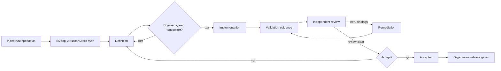

# Как работает Easy Peasy DLS

DLS добавляет к AI-разработке не ещё одну «методологию на все случаи», а несколько устойчивых границ. Модель занимается тем, где нужно суждение. Скрипты — тем, где нужна повторяемость. Человек сохраняет право определить результат и принять его.

## Основной цикл

У небольших изменений часть узлов схлопывается в одну задачу. У critical-изменений границы становятся строже, но смысл остаётся тем же.

## 1. Сформулировали

DLS сначала определяет масштаб и риск:

- `micro` — очевидная локальная правка;
- `routine` — компактное изменение с одним `CHANGE.md`;
- `standard` — отдельные definition, implementation и review;
- `roadmap` — несколько связанных delivery slices;
- `critical` — высокий риск для безопасности, данных, concurrency, migration, архитектуры или ключевого пользовательского пути.

Документы создаются не «потому что так положено». Они появляются только когда разделяют ответственность:

- `CHANGE.md` удерживает небольшое изменение целиком;
- `EPIC.md` объясняет outcome и границы крупного slice;
- `SPEC.md` фиксирует принятое поведение и решения;
- `TICKETS.md` делит реализацию на независимо проверяемые части;
- ADR нужен только для решения, которое действительно важно сохранить отдельно.

Если изменение затрагивает UI, definition должен ссылаться на принятый макет или содержать явное решение работать без него.

## 2. Сделали

После approval implementation получает компактный digest-bound context, а не полный transcript обсуждения. DLS:

- хранит execution state отдельно от authored Markdown;
- запускает только именованные argv-команды из `.dls/config.toml`;
- привязывает evidence к текущей ревизии;
- умеет зарегистрировать отдельный worktree без добавления каждого worktree как проекта Codex;
- возвращает одно типизированное `next_action`, когда следующий шаг пока невозможен.

Implementer может отметить finding как `addressed`, но не как `verified`. Если finding спорный или попал не в тот gate, `note` передаёт его на независимое adjudication и ничего не закрывает. Проверка исправления и reclassification принадлежат reviewer.

## 3. Независимо проверили

ReviewPack фиксирует:

- утверждённый definition digest;
- base и candidate Git SHA;
- актуальное validation evidence;
- тикеты и требования;
- режим полного или remediation-review;
- непрерывную цепочку предыдущих review.

Первый acceptance-grade review объединяет native diff-review и независимый semantic review. Для critical-изменений DLS может выбрать до трёх specialist lenses по фактическим risk tags.

Повторный review сначала проверяет delta и каждый предыдущий finding. Дорогой финальный whole-change pass запускается только если delta больше не содержит blocker. Каноническим становится один импортированный ReviewIR, а не любой сырой отчёт модели.

Короткая review-команда выбирает только pack текущего HEAD. Для повторного review DLS может сам создать remediation-pack из последнего ReviewIR; старый незавершённый pack не может перехватить новую проверку.

## Что остаётся за человеком

Только человек:

- подтверждает definition;
- разрешает scoped waiver;
- принимает результат;
- решает, можно ли выпускать продукт.

Фразы «всё зелёное» недостаточно. DLS отдельно показывает:

- реализовано ли изменение;
- есть ли актуальное validation evidence;
- получен ли `review-clear`;
- записан ли пользовательский `accept`;
- пройдены ли release и production gates.

## Где экономится контекст

- mechanics вынесены в Python CLI и JSON schemas;
- повторный review получает только последний актуальный ReviewIR и remediation manifest;
- evidence дедуплицируется по command ID;
- generated status не переписывает authored definition;
- routine work не получает пакет документов для critical work;
- новые сессии используют manifest вместо копирования старого диалога.

Это не гарантирует фиксированное число токенов: сложность задач различается. Цель — убрать предсказуемые повторы и оставить модели только работу, требующую понимания.
