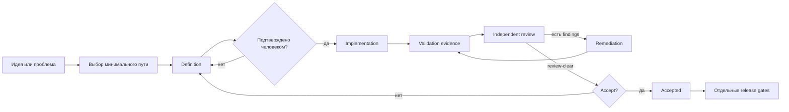

# Как работает Easy Peasy DLS

DLS добавляет к AI-разработке не ещё одну «методологию на все случаи», а несколько устойчивых границ. Модель занимается тем, где нужно суждение. Скрипты — тем, где нужна повторяемость. Человек сохраняет право определить результат и принять его.

## Основной цикл

У небольших изменений часть узлов схлопывается в одну задачу. У critical-изменений границы становятся строже, но смысл остаётся тем же.

## 1. Сформулировали

DLS сначала определяет масштаб и риск:

- `micro` — очевидная локальная правка;
- `routine` — компактное изменение с одним `CHANGE.md`;
- `standard` — отдельные definition, implementation и review;
- `roadmap` — несколько связанных delivery slices;
- `critical` — высокий риск для безопасности, данных, concurrency, migration, архитектуры или ключевого пользовательского пути.

Документы создаются не «потому что так положено». Они появляются только когда разделяют ответственность:

- `CHANGE.md` удерживает небольшое изменение целиком;
- `EPIC.md` объясняет outcome и границы крупного slice;
- `SPEC.md` фиксирует принятое поведение и решения;
- `TICKETS.md` делит реализацию на независимо проверяемые части;
- ADR нужен только для решения, которое действительно важно сохранить отдельно.

Если изменение затрагивает UI, definition должен ссылаться на принятый макет или содержать явное решение работать без него.

## 2. Сделали

После approval implementation получает компактный digest-bound context, а не полный transcript обсуждения. DLS:

- хранит execution state отдельно от authored Markdown;
- запускает только именованные argv-команды из `.dls/config.toml`;
- привязывает evidence к текущей ревизии;
- умеет зарегистрировать отдельный worktree без добавления каждого worktree как проекта Codex;
- возвращает одно типизированное `next_action`, когда следующий шаг пока невозможен.

После committed candidate один `candidate-ready` автоматически завершает
механическую часть implementation: выполняет обязательные review-команды,
создаёт exact-HEAD evidence, записывает заявленные dispositions и атомарно
создаёт ReviewPack. Implementer не переносит state revision, SHA или evidence
paths. Полные validation logs остаются в локальном cache; модель получает только
компактный итог или ограниченный фрагмент ошибки.

Если validation нашёл проблему, Codex исправляет её и коммитит новый candidate.
DLS не требует снова перечислять все findings: при неизменных ReviewIR,
definition, policy и finding set он наследует declaration из ближайшего
предыдущего candidate run, повторяет все обязательные проверки для нового HEAD
и принимает только явные изменения `addressed`/`note`. Потерянную краткую
ошибку можно безопасно восстановить через bounded diagnostic status без чтения
полного лога.

Если review-задача открыта раньше этого handoff или HEAD изменился после него,
DLS возвращает `prepare-candidate` и не запускает модели. Проверки и подготовка
пакета остаются в implementation-задаче; review-задача не пытается чинить
процесс самостоятельно.

Implementer может отметить finding как `addressed`, но не как `verified`. Если finding спорный или попал не в тот gate, `note` передаёт его на независимое adjudication и ничего не закрывает. Проверка исправления и reclassification принадлежат reviewer.

## 3. Независимо проверили

ReviewPack фиксирует:

- утверждённый definition digest;
- base и candidate Git SHA;
- актуальное validation evidence;
- тикеты и требования;
- режим полного или remediation-review;
- непрерывную цепочку предыдущих review.

Routine review — один изолированный Terra/high pass в implementation-задаче,
без Sol, specialists и отдельной review-задачи. Первый standard/critical
acceptance-grade review объединяет structured native diff-review и независимый
semantic review. Для critical-изменений DLS может выбрать до трёх specialist
lenses по фактическим risk tags. Эти проходы запускает DLS, а не текущая задача
и не обязательные subagents.

DLS запрашивает structured output и одновременно понимает bounded встроенное
представление `codex exec review`: raw response остаётся неизменным в cache, а
обычный ReviewIR строится из отдельной проверяемой проекции. Второй модельный
вызов для форматирования routine-result не нужен.

Повторный review сначала проверяет delta и каждый предыдущий finding. Если
подтверждён хотя бы один `blocker` или `should-fix`, compact reconciliation
сразу импортирует `not-clear`: final-full не запускается. Только clean delta
получает один whole-change pass без предварительной reconciliation.

Короткая review-команда вызывает один end-to-end runner. До каждого model-run он
атомарно записывает `running`, поэтому повторный запуск не создаёт вторую
проверку. Timeout, orphan, API failure, missing output и output cap допускают не
более одной инфраструктурной повторной попытки. Логически противоречивый, но
структурно корректный decision не запускает semantic-анализ заново: его получает
один компактный repair-pass без product source и outputs других lanes.

Перед semantic-вызовом runner сам проверяет совместимость output schema со
strict Codex contract. Если обновление DLS меняет prompt, schema или другой
model-facing input, новый digest контракта разрешает чистую попытку, сохраняя
старую как диагностическую историю и не повторяя уже завершённую native lane.

Runner выбирает только pack текущего HEAD. Для повторного review DLS может сам
создать remediation-pack из последнего ReviewIR; старый незавершённый pack не
может перехватить новую проверку. Итогом всегда служит импортированный
`review_result_path`, а не сырой transcript модели.

## Что остаётся за человеком

Только человек:

- подтверждает definition;
- разрешает scoped waiver;
- принимает результат;
- решает, можно ли выпускать продукт.

Фразы «всё зелёное» недостаточно. DLS отдельно показывает:

- реализовано ли изменение;
- есть ли актуальное validation evidence;
- получен ли `review-clear`;
- записан ли пользовательский `accept`;
- пройдены ли release и production gates.

## Где экономится контекст

- mechanics вынесены в Python CLI и JSON schemas;
- model-facing review context использует компактную проекцию pack и evidence metadata;
- повторный review получает только последний актуальный ReviewIR и remediation manifest;
- evidence дедуплицируется по command ID;
- successful validation output заменяется компактным результатом и digest;
- implementation handoff использует один deterministic `candidate-ready` вместо цикла CLI-команд;
- повторный candidate после validation failure не повторяет неизменившийся список findings;
- generated status не переписывает authored definition;
- routine work не получает пакет документов для critical work;
- новые сессии используют manifest вместо копирования старого диалога.

Это не гарантирует фиксированное число токенов: сложность задач различается. Цель — убрать предсказуемые повторы и оставить модели только работу, требующую понимания.
